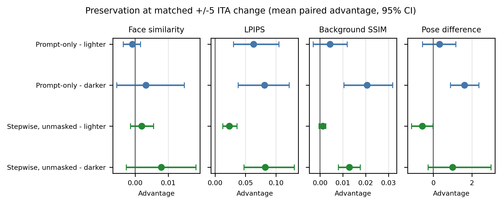

# Denoising-Time Skin-Tone Steering in SDXL

[](https://github.com/Arnavsharma2/sdxl-skin-tone-steering/actions/workflows/ci.yml)
[](pyproject.toml)
[](LICENSE)

Research code and retained evidence for evaluating whether a paired direction in
Stable Diffusion XL's VAE latent space can control apparent skin tone while
preserving other image properties.

This project studies an image-colour intervention. It does **not** infer or
change race or ethnicity, and the results do not establish general bias
mitigation or identity preservation.

## Paper and artifacts

- [Preprint PDF](output/pdf/arxiv_preprint.pdf)
- [Preprint source](paper/arxiv.tex)
- [Claims-to-evidence register](docs/CLAIMS_AND_EVIDENCE.md)
- [Reproducibility guide](docs/REPRODUCIBILITY.md)
- [Model card](docs/MODEL_CARD.md) and [data card](docs/DATA_CARD.md)
- [Ethics and responsible-use statement](docs/ETHICS.md)

## Main result

The study compares spatially masked denoising-time steering with unmasked
steering, post-hoc latent editing, and prompt-only control at approximately
matched measured skin-tone change.

| Finding | Evidence-backed interpretation |
|---|---|
| Masking reduced LPIPS relative to unmasked steering by 0.0235 for lighter edits and 0.0825 for darker edits in the parent campaign. | Spatial masking improved perceptual preservation under this specific SDXL protocol. |
| Every face-similarity contrast had a 95% confidence interval spanning zero. | The primary identity-preservation hypothesis was not supported. |
| An independent campaign retained the LPIPS effect signs and produced a masked-direction cosine of 0.919. | The direction and qualitative pattern were encouraging. |
| Only 8 and 10 shared matched seeds remained in the replication, below the prespecified minimum of 12. | The locked replication decision was **inconclusive coverage**, not a successful strict replication. |



The automated manuscript audit checks 16 central numerical claim groups
against the retained validation, analysis, robustness, and replication
artifacts.

## Method

Given noise-coupled portrait pairs, the direction is the mean VAE-latent
difference:

```text
v = mean_i(E(dark_descriptor_i) - E(light_descriptor_i))
```

A fixed Gaussian centre mask attenuates the direction outside the face region.
For steering strength `alpha` and `T` denoising steps, the implementation adds
`alpha / T * v` after each scheduler step. VAE encoding uses the deterministic
posterior mode.

## Quick start

Python 3.10 or 3.11 is recommended. Full SDXL generation requires substantial
GPU memory and access to the upstream model under its own license; the retained
analysis and tests do not require regenerating the CUDA image campaigns.

```bash
python3 -m venv .venv
source .venv/bin/activate
python -m pip install --upgrade pip
python -m pip install -r requirements.txt
make check
make paper-audit
```

Run the small historical demonstration:

```bash
python generate_training_data.py --n 8
make pilot
make summarize
```

The confirmatory and replication workflows use the prospectively frozen
configurations in `configs/`. See the [reproducibility guide](docs/REPRODUCIBILITY.md)
before attempting a full campaign.

## Repository map

```text
paper/                 manuscript source and figures
configs/               pilot, calibration, and frozen study configurations
data/generated/        content-attested manifests and generation ledgers
experiments/analysis/  retained aggregate evidence and claim audit
experiments/runs/      retained seed-level result ledgers
scripts/               study, audit, analysis, and plotting entry points
src/                   generation, steering, and metric implementations
tests/                 research-integrity and reproducibility tests
docs/                  protocol, limitations, ethics, and artifact records
```

Large image archives, model weights, and face embeddings are not committed.
The tracked manifests record filenames, generation signatures, and hashes for
the retained synthetic-image campaigns.

## Reproducing the retained conclusions

The CPU-side verification path is:

```bash
make check
make paper-audit
```

For the full workflow and artifact boundary, read:

1. [Research protocol](docs/RESEARCH_PROTOCOL.md)
2. [Replication protocol](docs/REPLICATION_PROTOCOL.md)
3. [Claims and evidence](docs/CLAIMS_AND_EVIDENCE.md)
4. [Artifact availability](docs/ARTIFACT_AVAILABILITY.md)
5. [Fresh-environment audit](docs/FRESH_ENVIRONMENT_AUDIT.md)

Failures and missing detector outputs remain in the result ledgers; they are
not silently dropped. The skin-tone outcome is a white-reference-normalized
bilateral-cheek CIE Lab/ITA image-colour proxy, not a demographic classifier.

## Responsible use

Do not use this code for race classification, profiling, identity decisions,
deceptive edits, or editing real people without consent. Synthetic portraits
can still resemble real individuals. Face embeddings are sensitive biometric
data and must not be committed or redistributed.

See [ETHICS.md](docs/ETHICS.md) for the full scope and limitations.

## Citation

Citation metadata is available in [CITATION.cff](CITATION.cff). Until the
preprint receives a persistent identifier, cite the repository release and
include the commit or version used.

## License

The repository code is released under the [Apache License 2.0](LICENSE).
Upstream models, weights, and datasets retain their own licenses and terms.
