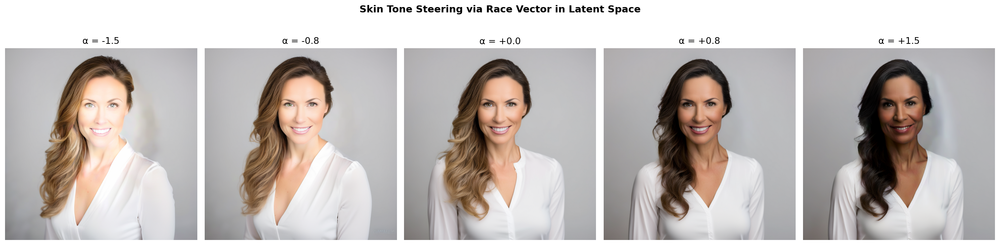
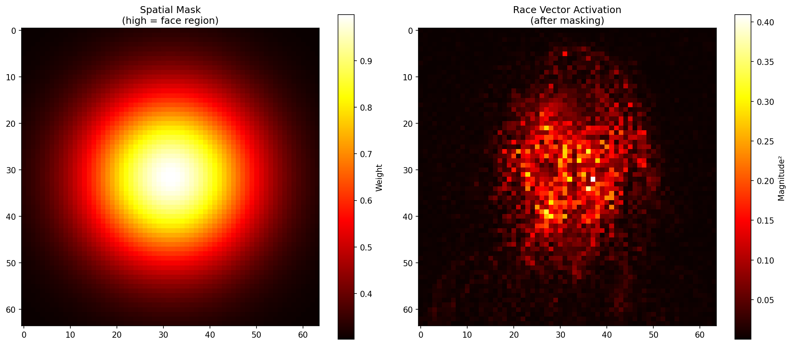

# Bias Mitigation in AI Image Generation

Extracts the linear **skin-tone direction** from Stable Diffusion XL's latent space and uses it to generate **counterfactual portraits** — the same face rendered across a continuous skin-tone spectrum — while preserving identity, pose, and background.

Built as a practical tool for **auditing skin-tone bias encoded in text-to-image generative models**.

`Python` · `PyTorch` · `Diffusers (SDXL)` · `ArcFace` · `MediaPipe` · `FaceNet` · `LPIPS`

---

## Results

| Base Portrait | Counterfactual Sweep (α = −1.5 → +1.5) |
|---|---|
|  |  |


All 4 counterfactuals pass every threshold:

| α | Face Similarity ↑ | LPIPS ↓ | Background SSIM ↑ | Pass |
|---|---|---|---|---|
| +1.5 | 0.894 | 0.204 | 0.798 | ✓ |
| +0.8 | 0.977 | 0.134 | 0.864 | ✓ |
| −0.8 | 0.994 | 0.242 | 0.847 | ✓ |
| −1.5 | 0.954 | 0.280 | 0.821 | ✓ |

*Thresholds: Face Similarity > 0.85 · LPIPS < 0.30 · Background SSIM > 0.75*

---

## The Core Technical Challenge

The naive approach — take the mean-difference vector between two groups of portrait latents, add it to the final latent, decode — produces blurry, out-of-distribution artifacts. The VAE decoder can't reconstruct a coherent face from a latent it never visited during the diffusion process.

**The fix:** inject the skin-tone vector at *every denoising step* via a `callback_on_step_end` hook. Because the denoiser sees and corrects for the perturbation at each step, it converges to a coherent steered image instead of an artifact.

| Spatial Mask | Application |
|---|---|
|  | Gaussian face mask weights the vector before injection, confining edits to facial skin and leaving background, hair, and clothing unchanged. |

---

## Technical Highlights

- **Steered denoising** — Race vector injected at each DPM++ 2M Karras step rather than added post-hoc to the final latent; keeps generations in-distribution and eliminates VAE decoding artifacts.
- **Spatial Gaussian masking** — Vector is attenuated by a face-centred Gaussian (radius 1.0, edge weight 0.3) before injection, isolating the skin-tone edit from background and hair.
- **FaceNet refinement** — Optional gradient-based optimisation step that refines the extracted vector to minimise ArcFace identity loss while maximising the attribute change.
- **Five-axis evaluation** — Face similarity (ArcFace), facial landmark RMSE (MediaPipe), perceptual similarity (LPIPS), background SSIM, and 3D head-pose drift.

---

## Architecture

```
generate_training_data.py        # synthesise paired portrait groups via SDXL
run_race_vector_extraction.py    # end-to-end pipeline (CLI: --steps, --alphas, --seed, --output)

src/
├── models/stable_diffusion.py      # SDXL wrapper — encode / decode / generate / steer
├── latent/
│   ├── vector_discovery.py         # race vector extraction + SVD decomposition
│   └── manipulator.py              # latent arithmetic, SLERP interpolation
├── metrics/
│   ├── identity_metrics.py         # face similarity, landmark RMSE, LPIPS
│   ├── structural_metrics.py       # background SSIM, 3D pose estimation
│   ├── disentanglement_metrics.py  # SAP, MIG, DCI scores
│   └── evaluator.py                # composite evaluation pipeline
└── visualization/
    └── grid_generator.py           # result grids and interactive HTML slider
```

---

## Quickstart

```bash
git clone https://github.com/Arnavsharma2/Isolating-Race-Vectors-in-Latent-Space.git
cd Isolating-Race-Vectors-in-Latent-Space
pip install -r requirements.txt

# Generate synthetic training portraits (~10 min on GPU)
python3 generate_training_data.py

# Extract race vector, generate counterfactuals, evaluate
python3 run_race_vector_extraction.py
```

```bash
# Options
python3 run_race_vector_extraction.py \
  --steps 25 \
  --alphas -1.5 -0.8 0.8 1.5 \
  --seed 999 \
  --output experiments/results
```

**Output files:**

| File | Description |
|---|---|
| `base_image.png` | Unsteered base portrait |
| `counterfactuals_strip.png` | All alpha values in one strip |
| `final_grid.png` | Grid with per-image metric overlay |
| `counterfactuals/alpha_±N.N.png` | Individual steered images |
| `metadata.json` | Full reproducibility record |
